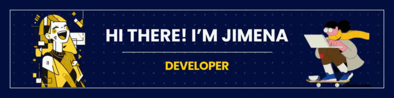

###

<h1 align="left">Hey 👋 What's up?</h1>
###

My name is Jimena and i'm from Paraguay 🇵🇾 

<h2 align="left">About me</h2>

###

✨ Creating bugs since 2005 📚 I'm currently learning ... 🎯 Goals: ... 🎲 Fun fact: ...

###

<h2 align="left">I code with</h2>

###

  
  
  
  
  
  
  
  
  

###
